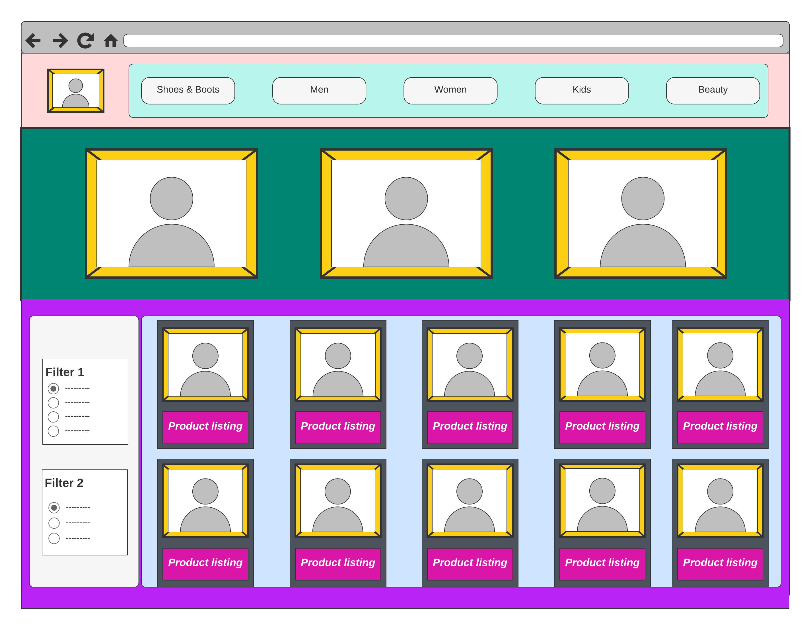
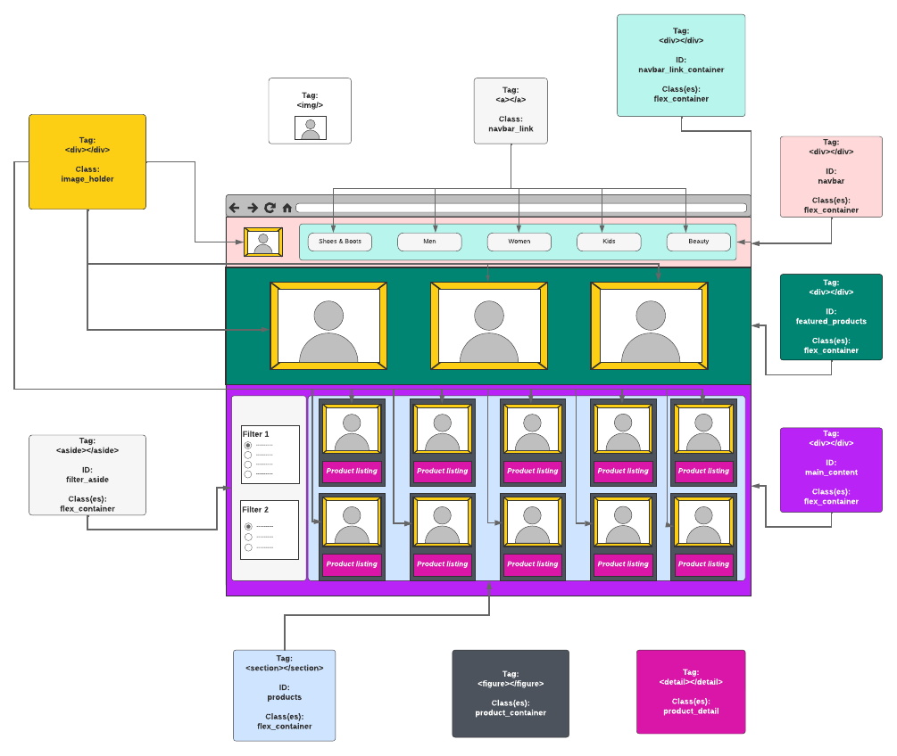

# Bringing Your Wireframe To Life

Today we are going to use what we've learned to generate a landing page from our wireframe. 

## Step 1

Annote your wirefram with IDs, classes and HTML tags

## Step 2

Write HTML code using the tags, IDs and classes you specified in Step 1

## Step 3

Write CSS to style your HTML. The goal is for your web page to look just like your wireframe.